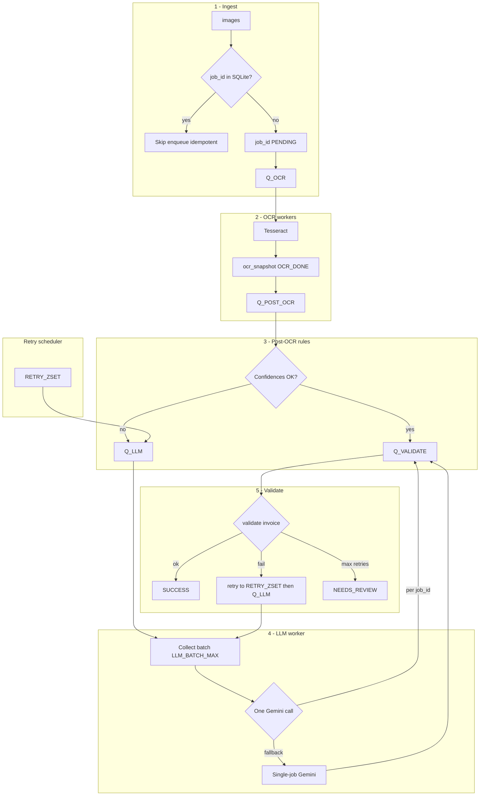
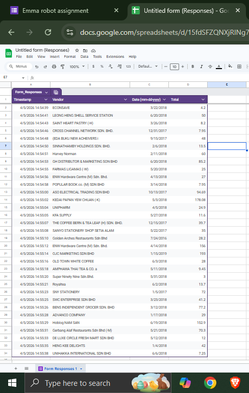

# Invoice OCR pipeline

A batch-oriented system that ingests receipt images from a folder, runs **Tesseract OCR** and **rule-based extraction**, escalates low-confidence or validation-failing cases to **Google Gemini**, and validates structured fields before persisting results. Processing is **parallel and queue-driven**: **Redis** holds work queues, **SQLite** (WAL mode) stores job state, and multiple **worker processes and threads** handle OCR, post-OCR rules, LLM calls, validation, and retries.

**Yes — the LLM stage often processes several invoices in a single Gemini request.** Workers dequeue up to `LLM_BATCH_MAX` jobs (default 3), wait briefly to fill the batch, build one prompt containing multiple receipts’ OCR text, issue **one** API call, then split the structured response per `job_id`. If batch parsing fails or a job is missing from the model output, the system **falls back to one API call per invoice** so nothing is silently dropped.

The primary entrypoint is [`main.py`](main.py): **(1)** run the pipeline on `IMAGES_DIR`, export results, then POST **`valid_invoices`** to the Google Form, or **(2)** **`--submit-only`** to POST from an existing export JSON without processing images. Jobs that cannot be automated reliably are routed to **`NEEDS_REVIEW`** and recorded in `results/human_review_queue.json`.

---

## What you get

| Capability | Details |
|------------|---------|
| Parallel throughput | Configurable OCR processes, LLM worker thread(s), post-OCR and validate thread pools |
| Batched LLM | Up to N invoices per Gemini call (`LLM_BATCH_MAX`, timing via `LLM_BATCH_*_WAIT_SEC`) |
| Durable jobs | SQLite-backed `InvoiceJob` rows survive restarts |
| Cost-aware AI | Rules first; Gemini when rule confidences are low or validation requests a stricter LLM pass |
| Observability | Structured `[pipeline]` logs, Redis-backed counters (`metrics` in export JSON) |
| Human handoff | Jobs that exhaust retries become `NEEDS_REVIEW` and appear in `results/human_review_queue.json` |
| Form integration | After each pipeline run, HTTP POST of successes to a Google Form (or submit-only from export) |

---

## Requirements

- **Python** 3.10+ (recommended)
- **Redis** 6+ reachable at `REDIS_URL` (default `redis://127.0.0.1:6379/0`)
- **Tesseract** on the host (Windows default path is set in [`config/settings.py`](config/settings.py); override with `TESSERACT_CMD`)
- **Google AI API key** for Gemini (`GEMINI_API_KEY` in `.env`)

```bash
pip install -r requirements.txt
pip install -e .   # recommended: install package so imports work without PYTHONPATH (especially on Windows + multiprocessing)
docker compose up -d
```

See [`docker-compose.yml`](docker-compose.yml) for the bundled Redis service.

---

## Configuration

1. Copy [`.env.example`](.env.example) to `.env` in the project root.
2. Set at least `GEMINI_API_KEY`.
3. Adjust paths (`IMAGES_DIR`, `TESSERACT_CMD`), Redis URL, pipeline timeouts, worker counts, and LLM batch settings as needed.

All tunables live in [`config/settings.py`](config/settings.py) (loaded via `python-dotenv`). [`src/receipt_pipeline/workers/config.py`](src/receipt_pipeline/workers/config.py) re-exports queue and worker constants for the `receipt_pipeline.workers` package.

---

## Quick start

```bash
python main.py
```

This resets Redis metrics (unless `EVAL_KEEP_METRICS=1`), optionally resets `results/human_review_queue.json` (unless `EVAL_ACCUMULATE_HUMAN_REVIEW=1`), starts workers, ingests top-level images under `IMAGES_DIR`, waits for terminal job states, writes `results/pipeline_export.json`, `pipeline_export.csv`, and `evaluation_summary.json`, then submits `valid_invoices` to the Google Form.

| Command | Effect |
|---------|--------|
| `python main.py` | Process images, export, then submit `valid_invoices` to the form |
| `python main.py --submit-only` | Skip the pipeline; submit from `results/pipeline_export.json` only |

Start Redis first (`docker compose up -d`) for the full pipeline (`--submit-only` does not need Redis). Wait duration for jobs is set by `PIPELINE_WAIT_TIMEOUT_SEC` in `.env` / [`config/settings.py`](config/settings.py).

---

## Output artifacts (latest run)

| File | Purpose |
|------|---------|
| [`results/pipeline_export.json`](results/pipeline_export.json) | `valid_invoices`, `needs_human_review`, `legacy_dlq`, `non_terminal`, `summary`, `metrics`, `observability` |
| [`results/pipeline_export.csv`](results/pipeline_export.csv) | Flattened rows |
| [`results/evaluation_summary.json`](results/evaluation_summary.json) | Run-level outcomes derived from the export |
| [`results/human_review_queue.json`](results/human_review_queue.json) | Rich detail for `NEEDS_REVIEW` jobs |

The results for 33 invoices have been intentionally included in this repository to facilitate evaluation of the assignment.

---

## Idempotency

**Goal:** Re-running ingestion or restarting workers must not create duplicate work for the same logical job.

- **Stable identity:** Each invoice is assigned a **`job_id`** (UUID) at first ingest. That identifier is the primary key in SQLite (`invoice_jobs`).
- **Ingest:** If [`src/receipt_pipeline/workers/orchestration/ingestion.py`](src/receipt_pipeline/workers/orchestration/ingestion.py) sees a row that already exists for a given `job_id`, it **does not** enqueue another OCR message. The pipeline remains safe to call twice with the same id.
- **State is authoritative:** Redis queues are **ephemeral**; the **database row** is the source of truth for whether a job exists and what stage it reached. Clearing Redis does not duplicate rows; it may require re-enqueueing work in edge cases, but duplicate **rows** are avoided by the ingest check.
- **Exports:** Each run overwrites the latest `pipeline_export.json` / `evaluation_summary.json` for observability of the **current** batch (unless you opt into accumulating human-review history via env).

The architecture diagram below includes an **idempotent ingest** gate to show this explicitly.

---

## Key components and data flow

| Layer | Role |
|-------|------|
| **Orchestrator** ([`src/receipt_pipeline/workers/orchestration/orchestrator.py`](src/receipt_pipeline/workers/orchestration/orchestrator.py), [`main.py`](main.py)) | Starts workers, ingests folder, waits for completion, exports JSON/CSV, evaluation summary, form submit. |
| **Redis** | List queues (`Q_OCR`, `Q_POST_OCR`, `Q_LLM`, `Q_VALIDATE`) for fan-out work; **sorted set** `RETRY_ZSET` for time-delayed retries. |
| **SQLite** | Durable `InvoiceJob` records: OCR snapshots, extraction payloads, status, retries, errors. |
| **OCR** ([`src/receipt_pipeline/workers/core/ocr_worker.py`](src/receipt_pipeline/workers/core/ocr_worker.py), [`src/receipt_pipeline/ocr/ocr.py`](src/receipt_pipeline/ocr/ocr.py)) | Multiprocess Tesseract; writes `ocr_snapshot`. |
| **Rules** ([`src/receipt_pipeline/workers/core/post_ocr_worker.py`](src/receipt_pipeline/workers/core/post_ocr_worker.py), [`src/receipt_pipeline/extractors/`](src/receipt_pipeline/extractors/), [`src/receipt_pipeline/pipeline/stages.py`](src/receipt_pipeline/pipeline/stages.py)) | Heuristic vendor/date/total + confidences; route to validate or LLM. |
| **LLM** ([`src/receipt_pipeline/workers/core/llm_worker.py`](src/receipt_pipeline/workers/core/llm_worker.py), [`src/receipt_pipeline/pipeline/llm_batch/`](src/receipt_pipeline/pipeline/llm_batch/), [`src/receipt_pipeline/llm/`](src/receipt_pipeline/llm/)) | Batched or single Gemini calls; structured JSON mapped back per `job_id`. |
| **Validation** ([`src/receipt_pipeline/workers/core/validate_worker.py`](src/receipt_pipeline/workers/core/validate_worker.py), [`src/receipt_pipeline/pipeline/validation/validation_layer.py`](src/receipt_pipeline/pipeline/validation/validation_layer.py)) | Schema and business rules; success, retry with new strategy, or human review. |
| **Retry scheduler** ([`src/receipt_pipeline/workers/retry/retry_ops.py`](src/receipt_pipeline/workers/retry/retry_ops.py)) | Moves due retries from `RETRY_ZSET` back onto target queues. |
| **Submit** ([`src/receipt_pipeline/submission/service.py`](src/receipt_pipeline/submission/service.py)) | POST only `valid_invoices` to Google Forms. |

**Data flow (happy path):** image file → ingest (DB row + `Q_OCR`) → OCR (`ocr_snapshot`, `Q_POST_OCR`) → rules (confidences) → either **`Q_VALIDATE`** (fast path) or **`Q_LLM`** → **`Q_VALIDATE`** → `SUCCESS` → export → form submit.

**Unhappy path:** any stage can increment retries, schedule delayed reprocessing to LLM (or OCR in some failures), or end in **`NEEDS_REVIEW`** with a JSON audit trail.

---

## Heuristic confidence and candidate selection (rules stage)

The system does **not** use a single global “model confidence” for vendor, date, and total. Instead, each field uses **hand-crafted heuristics** that combine OCR signals, layout, and domain rules. Values are turned into **per-field confidences in [0, 1]** used for routing (whether to skip the LLM).

### Vendor

- OCR is restricted to the **top band** of the receipt (header area), where merchant names usually appear.
- Lines are grouped into visual lines; lines are filtered using **negative phrases** (invoice boilerplate, addresses, “thank you”, tax wording, etc.) and **positive business-like tokens** (e.g. trading, SDN BHD, hardware).
- Lines that look **handwritten or stamped** (low average Tesseract confidence per token, or erratic character heights) are dropped as unreliable.
- **Candidate vendor strings** are formed by merging up to a few consecutive lines; each candidate receives a **score** from uppercase ratio, positive-word hits, length sweet spot, word-count penalty (to avoid addresses), and position near the top.
- The best candidate’s score is **normalized** to a confidence. If nothing clears a minimum score, vendor is treated as missing / low confidence.

### Date (invoice date, not clock time)

- Multiple **date regex patterns** scan OCR lines (numeric and textual month forms).
- Matches that look like **clock times** (e.g. containing `:`) are skipped so “12:30” is not mistaken for a calendar date.
- Each candidate receives a **composite score**: boosts when the surrounding line mentions “date” / “invoice”, a **vertical position** preference (dates often appear higher on the slip), plus the underlying **Tesseract confidence** for that text region.
- The **highest-scoring** candidate wins; its OCR confidence contributes to the date field’s confidence for routing.

### Total (amount payable)

- Words are read from a **preprocessed** binarized image; tokens are grouped into rows.
- Rows whose text matches **prioritized labels** (“Grand total”, “Total payable”, “Net payable”, …) receive a **label score**. Rows matching **skip patterns** (discount, subtotal, change, GST-only lines, etc.) are ignored.
- On eligible rows, **numeric tokens** are parsed as currency amounts (with simple normalization for `RM`, commas, common OCR confusions). When several numbers appear, the implementation tends toward the **largest plausible amount** on that row (totals are often the dominant figure next to the label).
- Among labeled rows, candidates are ordered by **label strength** and **vertical position** (lower on the receipt often corresponds to the final total). The winning candidate’s label score is **mapped** to a confidence in `[0, 1]`.

### Example: OCR on receipt

The following real receipt (**LEONG HENG SHELL SERVICE STATION**) illustrates typical layout: vendor in the header, several monetary amounts (e.g. Total, Cash, Total Gross), and a **date** in a footer row next to **time** (`20/06/18` with `00:05`). The second image shows the same scan with **vendor** (red), **total** (green, here aligned with the gross total line), and **date** (blue) highlighted—mirroring how heuristics target regions before confidence scores feed the routing step below.


### Routing thresholds (rules → LLM)

After these three confidences are known, a **deterministic policy** sends the job to the LLM if vendor is weak, total is extremely weak, or date is weak (see logs in post-OCR: “vendor<0.5 OR total<0.05 OR date<0.1”). This encodes the idea that **missing totals are more dangerous** than a slightly fuzzy vendor name, so the bar for “total” is higher.

---

## End-to-end pipeline (step by step)

Each image becomes one **`InvoiceJob`** (`job_id`). State is stored in SQLite; **Redis list queues** move work between stages; a **sorted set** (`RETRY_ZSET`) holds delayed retries with exponential backoff.

### 1. Ingestion

[`src/receipt_pipeline/workers/orchestration/ingestion.py`](src/receipt_pipeline/workers/orchestration/ingestion.py) scans **only the top level** of `IMAGES_DIR` for `.jpg` / `.jpeg` / `.png`, creates a row (`PENDING`), and **LPUSH**es `{"job_id": ...}` to **`Q_OCR`**. **Idempotent:** if the `job_id` already exists in the DB, no duplicate row and no duplicate enqueue.

### 2. OCR (multiprocess)

[`src/receipt_pipeline/workers/core/ocr_worker.py`](src/receipt_pipeline/workers/core/ocr_worker.py) runs **N parallel processes** (`OCR_PROCESSES`). Each job: load image → **Tesseract** via [`src/receipt_pipeline/ocr/ocr.py`](src/receipt_pipeline/ocr/ocr.py) → serialize OCR regions into **`ocr_snapshot`** on the job row → status **`OCR_DONE`** → enqueue **`Q_POST_OCR`**. Failures increment **`retry_count`**; after **`max_retries`**, the job is finalized as **`NEEDS_REVIEW`** and appended to **`human_review_queue.json`**.

### 3. Post-OCR rules and routing

[`src/receipt_pipeline/workers/core/post_ocr_worker.py`](src/receipt_pipeline/workers/core/post_ocr_worker.py) reads **`ocr_snapshot`**, runs **regex/heuristic extraction** ([`src/receipt_pipeline/pipeline/stages.py`](src/receipt_pipeline/pipeline/stages.py)), and computes confidences for vendor, total, and date.

- If **all** confidences pass thresholds (**fast path**): build **`extraction_payload`** with source **`OCR_RULE`**, set status **`VALIDATING`**, enqueue **`Q_VALIDATE`** — **no LLM call**.
- If **any** field is too uncertain: increment **`llm_fallback_routed`**, set **`LLM_PENDING`**, **LPUSH** to **`Q_LLM`** with a **strategy** string (e.g. `default`, later `after_validation_fail`, `ocr_retry`).

### 4. LLM extraction — batched multi-invoice calls

[`src/receipt_pipeline/workers/core/llm_worker.py`](src/receipt_pipeline/workers/core/llm_worker.py) implements **batch collection**: block on **`Q_LLM`**, then pull more messages until **`LLM_BATCH_MAX`** jobs are collected (or the queue is empty).

- **Batch path:** [`src/receipt_pipeline/pipeline/llm_batch/batch_llm.py`](src/receipt_pipeline/pipeline/llm_batch/batch_llm.py) merges strategies with **`merge_batch_strategies`**, builds **one prompt** ([`src/receipt_pipeline/pipeline/llm_batch/prompt_builder.py`](src/receipt_pipeline/pipeline/llm_batch/prompt_builder.py)), calls Gemini **once**, parses JSON ([`src/receipt_pipeline/pipeline/llm_batch/batch_parser.py`](src/receipt_pipeline/pipeline/llm_batch/batch_parser.py)). Per `job_id`, write **`extraction_payload`**, **`VALIDATING`**, **`Q_VALIDATE`**.

- **Fallback:** If the batch response does not parse or a **`job_id`** is missing, those jobs run **single-invoice** Gemini calls.

### 5. Validation

[`src/receipt_pipeline/workers/core/validate_worker.py`](src/receipt_pipeline/workers/core/validate_worker.py) runs [`src/receipt_pipeline/pipeline/validation/validation_layer.py`](src/receipt_pipeline/pipeline/validation/validation_layer.py).

- **Pass:** Normalize fields, set **`SUCCESS`**, increment **`success_total`**.
- **Fail (retries left):** Schedule **`RETRY_ZSET`** → **`Q_LLM`** with a **new strategy** ([`src/receipt_pipeline/workers/retry/retry_strategy.py`](src/receipt_pipeline/workers/retry/retry_strategy.py)).
- **Fail (no retries left):** **`NEEDS_REVIEW`**, **`human_review_queue.json`**.

### 6. Retry scheduler

[`src/receipt_pipeline/workers/retry/retry_ops.py`](src/receipt_pipeline/workers/retry/retry_ops.py): due retries are moved back to target queues. Delay ≈ **`RETRY_BASE_SEC * 2^retry_count`**, capped by **`RETRY_CAP_SEC`**, with jitter.

### 7. Orchestrator shutdown and export

[`src/receipt_pipeline/workers/orchestration/orchestrator.py`](src/receipt_pipeline/workers/orchestration/orchestrator.py) waits for terminal states or timeout, then [`src/receipt_pipeline/workers/orchestration/export_results.py`](src/receipt_pipeline/workers/orchestration/export_results.py) and [`src/receipt_pipeline/pipeline/evaluation/evaluation_summary.py`](src/receipt_pipeline/pipeline/evaluation/evaluation_summary.py).

### Architecture diagram (with idempotent ingest)



---

## Architecture decision record (ADR)

| Decision | Rationale | Tradeoff |
|----------|-----------|----------|
| **Redis + workers** | Decouple CPU-heavy OCR from I/O and LLM latency; scale OCR horizontally | Requires Redis and more moving parts than a monolithic script |
| **SQLite per job** | Durable, idempotent jobs; simple ops | Not ideal for very high write QPS; fine for batch receipts |
| **Tesseract for OCR** | Mature, local, no extra GPU; fine-grained word boxes for heuristics | Weaker on messy handwriting vs some deep models; see OCR section below |
| **Rules before LLM** | Cost and latency; most fields resolved without API calls | Edge receipts need LLM or human review |
| **Batched LLM** | Fewer round-trips when several jobs wait | More complex parsing; fallback to single-job on failure |
| **Strict validation gate** | Single business-quality checkpoint | More `NEEDS_REVIEW` if rules are tight |
| **HTTP POST to `formResponse`** | Simple, scriptable, no browser | Field IDs must match form; not “official” Forms API |
| **Human review file** | Auditable queue for automation limits | Manual follow-up outside the happy path |

---

## Deterministic methods versus AI

| Use deterministic (regex, Tesseract, arithmetic validation) when… | Use Gemini when… |
|---------------------------------------------------------------------|------------------|
| The task is **pattern-matching** on OCR text with known layouts | Fields are **semantically ambiguous** (multiple plausible totals, noisy vendor strings) |
| You need **reproducible** behavior and **auditability** | Rule confidences fall **below routing thresholds** |
| Cost and **latency** must stay predictable | Validation failed but a **stricter prompt / retry** may recover structured JSON |
| You can define **hard validation rules** (date ranges, numeric sanity) | OCR text is too incomplete for reliable regex capture |

The system **defaults to determinism** and treats the LLM as a **targeted fallback** and **retry escalator**, not the primary reader of every receipt.

---

## Use of AI

### Where AI is used

- **Google Gemini** ([`src/receipt_pipeline/llm/`](src/receipt_pipeline/llm/), [`src/receipt_pipeline/pipeline/llm_batch/`](src/receipt_pipeline/pipeline/llm_batch/)) for structured extraction when **post-OCR confidences** are low or when **validation** schedules an LLM retry with a stricter **strategy** (`after_validation_fail`, `strict_json`, `ocr_retry`).

### Why it was appropriate

- Receipts vary in layout, language, and print quality; **pure rules** miss ambiguous vendor strings, unusual date formats, or totals buried in noise.
- The LLM consumes **OCR text** (and job context), not raw pixels in the batch path—keeping inputs **traceable** and prompts **versionable**.
- **Batching** reduces cost versus per-image calls when many jobs need help at once.

### Limitations and tradeoffs

- **API quotas and latency** (rate limits, 429 retries via env).
- **Hallucination / format risk** mitigated by **JSON parsing**, **validation**, and **retries**, not blind trust.
- **Batch responses** can be malformed; the code **falls back to single-job** calls.
- Model upgrades may change behavior; keep **golden tests** or spot-check exports in production.

---

## OCR engine: Tesseract versus alternatives

| Engine | Strengths | Weaknesses |
|--------|-----------|------------|
| **Tesseract** | Open source, CPU-friendly, excellent **word-level boxes** and confidences for heuristics, widely deployed | Weaker on some handwriting / low-DPI photos without tuning |
| **EasyOCR** | Deep learning, often strong on scene text | Heavier dependencies (PyTorch/GPU optional); different output shape—would require re-plumbing extractors |
| **PaddleOCR** | Strong accuracy on many benchmarks | Same integration cost; larger footprint |

**Why Tesseract here:** the extractors rely on **Tesseract’s per-token confidence and layout** to score vendor lines and totals. Swapping engines is possible but is a **project-level** change (new OCR adapter, re-tuned heuristics, re-benchmarked thresholds).

---

## Google Form submission: HTTP POST versus browser automation

**Chosen approach:** direct **`requests.post`** to the form’s **`formResponse`** URL with `application/x-www-form-urlencoded` body ([`src/receipt_pipeline/submission/service.py`](src/receipt_pipeline/submission/service.py)).

| Approach | Pros | Cons |
|----------|------|------|
| **HTTP POST (current)** | Fast, headless, easy to retry and log; no browser binary | Must keep `entry.xxxxx` IDs in sync with the form |
| **Playwright / Selenium / Puppeteer** | Can drive dynamic UIs | Heavier, flakier, slower; unnecessary for standard Google Forms public endpoints |

Public Google Forms continue to accept well-formed POSTs mirroring the browser; for **batch server-side submission**, HTTP is the **reliable, minimal** interface.

submission info is given below:

---

## Reliability and robustness (real-world variability)

| Challenge | Mitigation |
|-----------|------------|
| **OCR noise** | Line filtering, negative phrase lists, minimum scores, handwriting detection for vendor; date patterns reject time-like strings; totals use label priors and skip rows for “change”, “subtotal”, etc. |
| **Missing / incomplete fields** | Low confidences **route to LLM**; validation rejects empty or nonsensical values; **retries** with stricter strategies |
| **Multiple monetary amounts** | Total extractor scores **row labels** and picks plausible amounts on the best-scoring lines; validation enforces positive, bounded totals |
| **Format inconsistencies** | Date normalization tries several string formats; validation accepts a small set of normalized forms |
| **Ambiguous vendor lines** | Scoring favors business-like tokens and penalizes long multi-word address-like lines |

---

## Validation, ambiguous outputs, and retry strategies

- **Validation** ([`src/receipt_pipeline/pipeline/validation/validation_layer.py`](src/receipt_pipeline/pipeline/validation/validation_layer.py)) enforces: non-empty vendor that is not “numeric-only”, parseable **reasonable** date (not future, not absurdly old), positive **bounded** total. Optional Pydantic model pass for consistency.
- **Ambiguous LLM output:** If JSON parsing fails or fields are missing, LLM stage triggers **retries** with different **strategies** ([`src/receipt_pipeline/workers/retry/retry_strategy.py`](src/receipt_pipeline/workers/retry/retry_strategy.py)): e.g. move from default extraction to **stricter JSON**, then **OCR-focused** prompts after validation failures.
- **Backoff:** Retries land on **`RETRY_ZSET`** with increasing delay to avoid hot-looping APIs or the database.

---

## Failure modes

### What types of errors occur

| Area | Examples |
|------|----------|
| **OCR** | Poor image quality, skew, low DPI → empty or wrong text |
| **Rules** | No line passes vendor heuristics; multiple totals compete |
| **LLM** | Parse errors, API errors, wrong field association in batch |
| **Validation** | Future date, empty vendor, non-positive total |
| **Infrastructure** | Redis down, SQLite busy, worker crash |

### How the system handles them

- **Retries** with exponential backoff and **strategy escalation** for LLM and validation failures.
- **Max retries** → **`NEEDS_REVIEW`** with **`human_review_queue.json`** (never auto-submitted to the form).
- **Metrics** (`metrics` in export) and structured logs for cross-process visibility.
- **Batch LLM failure** → automatic **single-invoice** fallback.

---

## Project intricacies (quick reference)

| Topic | Behavior |
|-------|----------|
| **Batch vs single LLM** | Prefer one request for many jobs; single-invoice on parse errors or missing `job_id` |
| **Strategy merge** | Strictest prompt wins in a batch (`merge_batch_strategies`) |
| **Metrics** | Reset each run unless `EVAL_KEEP_METRICS=1` |
| **Human review file** | Fresh file per run unless `EVAL_ACCUMULATE_HUMAN_REVIEW=1` |
| **SQLite** | WAL + timeouts for concurrent workers |

For package layout, see [`src/receipt_pipeline/workers/README.md`](src/receipt_pipeline/workers/README.md).

---

## Google Form submission (details)

The integration is **HTTP POST** to Google’s **`formResponse`** endpoint ([`src/receipt_pipeline/submission/service.py`](src/receipt_pipeline/submission/service.py)) — not the OAuth Forms API; it mirrors a browser submission.

- **Sent:** only **`valid_invoices`** from `pipeline_export.json` (`SUCCESS` rows). **Never** human-review rows.
- **Date field:** normalized for POST using **`SUBMIT_DATE_FORMAT`** (default **`iso`** = `YYYY-MM-DD`). Google’s built-in **Date** question rejects `DD/MM/YYYY` and returns HTTP 400; use `iso` unless the form uses a **short-answer** text field, then set `SUBMIT_DATE_FORMAT=dmy` for `DD/MM/YYYY`.
- **Hidden fields:** the client **GET**s the viewform page once per batch and sends **`fbzx`** / **`fvv`** with each POST (required by Google; without them you get HTTP 400 “Something went wrong”).
- **Fields:** `SUBMIT_FORM_URL`, `SUBMIT_ENTRY_VENDOR`, `SUBMIT_ENTRY_DATE`, `SUBMIT_ENTRY_TOTAL`.
- **Runtime:** full pipeline via `python main.py` (process + submit); submit-only via `python main.py --submit-only`.
- **Robustness:** browser-like **User-Agent**, treat **2xx** as success, **`SUBMIT_DELAY`** between posts, retries with backoff.

---

## Project layout (abbreviated)

```
├── main.py                 # CLI entry; adds src/ to path if package not installed
├── pyproject.toml          # package: receipt-pipeline (import name: receipt_pipeline)
├── requirements.txt
├── config/                 # settings, logging (env + dotenv)
├── src/receipt_pipeline/
│   ├── pipeline/           # stages, llm_batch, validation, evaluation
│   ├── workers/            # orchestration, core workers, Redis, DB, retry
│   ├── ocr/
│   ├── llm/
│   ├── extractors/
│   ├── schemas/
│   └── submission/         # Google Form HTTP POST
├── tests/
├── docs/
├── data/                   # SQLite (default)
├── images/                 # input images (IMAGES_DIR)
├── results/                # exports, human review queue
└── docker-compose.yml
```

---

## Troubleshooting

| Symptom | What to check |
|---------|----------------|
| Redis connection errors | `docker compose ps`, `REDIS_URL` |
| SQLite locked | WAL; close external DB viewers |
| Empty `valid_invoices` | See `needs_human_review` |
| Form 2xx but no rows | Wrong `entry.xxxxx` |
| High `llm_single_calls` | Batch parse failures in logs |
| Gemini 429 / quota | `GEMINI_RPM`, `GEMINI_429_MAX_RETRIES` |

Logs: [`logs/app.log`](logs/app.log).

---

## Improvements (with more time)

- **Interface for human review queue:** Interface to validate the human review queue and submitting the data.
- **Observability:** OpenTelemetry, JSON logs, Prometheus scrape of Redis metrics.
- **Testing:** Golden OCR fixtures, contract tests on exports, mocked LLM.
- **OCR:** Optional second engine for low-confidence pages.
- **Forms:** Official Google APIs or Apps Script if OAuth / ownership policies require it.
- **Deployment:** Container images, separate LLM worker tier, DLQ review UI.
- **Caching:** Avoid reprocessing same invoice.Hash image and reuse results.
---

## License / evaluation

This repository is intended for **reproducible batch processing**, **clear rules-vs-LLM boundaries**, and **auditable exports**. Replace default form URLs and entry IDs with your own Google Form for production.
