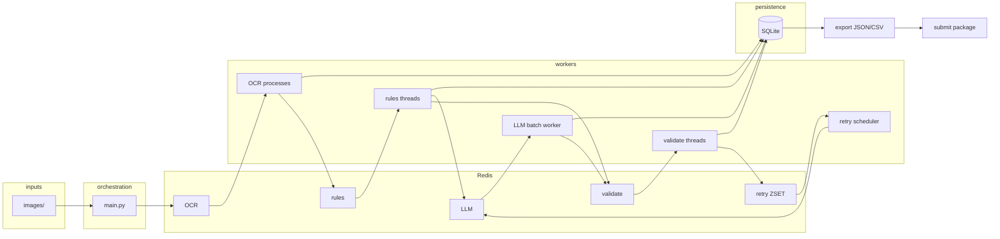

# Invoice OCR & extraction pipeline

Production-style pipeline: **Tesseract OCR**, **rule-based extraction**, **optional Gemini LLM** for low-confidence cases, **strict validation**, **Redis queues**, **SQLite** job store, **human review queue**, and **Google Form** submission for validated rows only.

---

## Repository layout

```
folder1/
├── README.md                 # This file
├── main.py                   # CLI: one-shot or daemon pipeline
├── requirements.txt
├── docker-compose.yml        # Redis for pipeline mode
├── .env                      # API keys (not committed)
├── config/                   # Paths, Gemini/Tesseract settings
├── workers/                  # pipelines/, core/, redis/, retry/, utils/, db/
├── pipeline/                 # Stages, validation, batch LLM, fallbacks
├── ocr/                      # OCRReader (Tesseract)
├── extractors/               # Vendor, date, total heuristics
├── llm/                      # Gemini client + pacing
├── invoice_validation/       # Optional helpers (legacy / experiments)
├── invoice_submission/       # Thin wrapper → submit package
├── submit/                   # Google Form integration (valid_invoices only)
├── scripts/                  # Evaluation receipt generation, eval harness
├── images/                   # Input images (top-level files ingested in pipeline)
├── data/                     # SQLite DB (default: invoices.db)
└── results/                  # Exports, human review queue, evaluation artifacts
```

**Run from the project root** so imports resolve (`python main.py`, `python -m submit`).

---

## Quick start

1. **Python 3.11+**, **Tesseract** on `PATH` or `TESSERACT_CMD`, **Redis** for pipeline mode (`docker compose up -d`).
2. `pip install -r requirements.txt`
3. `.env`: `GEMINI_API_KEY` (or your project’s variable read by `llm/client.py`).
4. Place invoice images under `images/` (top-level `.jpg` / `.jpeg` / `.png`).
5. **Run the pipeline**  
   `python main.py --pipeline-timeout 900`  
   Optional: `--submit-form` to POST **only** `valid_invoices` from `results/pipeline_export.json` to the Google Form (human-review rows are **not** submitted).
6. **Standalone form submit** (after a run):  
   `python -m submit --export results/pipeline_export.json`
7. **Evaluation metrics (per run)** — Redis counters are **reset at each pipeline start** so `results/evaluation_summary.json` and `pipeline_export.json` → `metrics` reflect **only the current run**. Set **`EVAL_KEEP_METRICS=1`** to keep cumulative counters (debug). **`evaluation_history.jsonl`** defaults to **latest run only** (overwrite); set **`EVAL_APPEND_HISTORY=1`** to append multiple runs.
8. **SQLite** — the DB uses **WAL mode** and long **busy timeouts** so parallel OCR workers and the orchestrator rarely hit `database is locked`. If you still see locks, lower **`OCR_PROCESSES`** (env) temporarily.

---

## System design

### End-to-end architecture

1. **Ingestion** creates one **job** per image file (direct children of `IMAGES_DIR` only), persists to **SQLite**, enqueues **OCR**.
2. **OCR worker** runs Tesseract, stores an **OCR snapshot** (text + geometry), enqueues **post-OCR (rules)**.
3. **Rules worker** extracts vendor / date / total with confidence scores.  
   - If confidences are sufficient → **validate** (no LLM).  
   - Otherwise → **LLM queue** (Gemini, optionally **batched** to reduce API calls).
4. **Validate worker** applies schema and business rules.  
   - Pass → **SUCCESS**.  
   - Fail → retry via **LLM** with a stricter strategy, or **NEEDS_REVIEW** after max retries.
5. **Retry scheduler** (Redis **sorted set**) re-queues failed jobs with exponential backoff.
6. **Export** writes `results/pipeline_export.json` + `.csv`, merges **metrics**, writes **evaluation** summaries.
7. **Submission** reads **`valid_invoices`** only (validated successes). **`needs_human_review`** never goes to the form.



### Key components and data flow

| Component | Responsibility |
|-----------|----------------|
| `workers/ingestion.py` | Create jobs, enqueue OCR |
| `workers/ocr_worker.py` | Tesseract, OCR snapshot, retries on failure |
| `workers/post_ocr_worker.py` | Rule extraction, route to LLM vs validate |
| `workers/llm_worker.py` | Gemini batch/single extraction |
| `workers/validate_worker.py` | Validation, SUCCESS vs retry vs NEEDS_REVIEW |
| `workers/retry_ops.py` | Backoff scheduling |
| `workers/export_results.py` | JSON/CSV export + metrics + observability |
| `workers/evaluation_summary.py` | Evaluation JSON + JSONL history + aggregate summary |
| `submit/service.py` | HTTP POST `valid_invoices` to Google Form |

**Data contracts:** Job state lives in **`invoice_jobs`** (status, OCR JSON, extraction payload, retries, errors). Exports mirror that for analysis and submission.

---

## Architecture decision record (ADR)

| Decision | Rationale | Tradeoff |
|----------|-----------|----------|
| **Redis + workers** | Decouple CPU-heavy OCR from I/O and LLM latency; horizontal scaling of OCR processes | Requires Redis and more moving parts than a single script |
| **SQLite per job** | Durable idempotent jobs, survives restarts, simple ops | Not ideal for very high write QPS; fine for batch invoice processing |
| **Rules before LLM** | Cost and latency: most fields from OCR + heuristics | Edge cases need LLM or human review |
| **Batched LLM calls** | Fewer round-trips when multiple jobs wait | Slightly more complex parsing; fallback to single-job on parse issues |
| **Strict validation after extraction** | Single gate for business correctness | Can increase NEEDS_REVIEW if rules are tight |
| **Human review file + optional API** | Auditable queue for failures | Manual follow-up outside the happy path |
| **Submit only `valid_invoices`** | Form receives only automated successes | Operators must fix NEEDS_REVIEW rows separately |

---

## Use of AI

### Where AI was used

- **Gemini** (`llm/`, `pipeline/batch_llm.py`, `workers/llm_worker.py`) for structured extraction when **rule confidences** are below thresholds, or when **validation** requests a stricter LLM pass after failure.
- **Optional** auxiliary paths in `invoice_validation/` for experiments; production path uses `pipeline/validation_layer.py`.

### Why it was appropriate

- Receipts vary in layout and quality; **pure rules** miss ambiguous vendor names, dates, or totals.
- LLM is used as a **targeted fallback** after OCR + rules, not for every page—**cost-aware** and **observable** (metrics: `llm_invocations`, batch vs single).

### Limitations and tradeoffs

- **API quotas / latency** (rate limiting in `llm/gemini_llm.py`).
- **Hallucination risk** mitigated by **validation** and **retry strategies**, not blind trust.
- **Batch responses** can mis-associate jobs if parsing fails—code falls back to **single-job** calls.
- **Deprecated** `google.generativeai` SDK warning—migration to `google.genai` recommended when feasible.

---

## Failure modes

### What types of errors occur

| Area | Examples |
|------|----------|
| **OCR** | Poor image quality, skew, low DPI → empty/garbled text |
| **Rules** | Regex/heuristics miss format variants |
| **LLM** | Parse errors, API errors, wrong field extraction |
| **Validation** | Date out of range, total format, vendor empty |
| **Infrastructure** | Redis down, DB locked, worker crash |

### How the system handles them

- **Retries** with exponential backoff (`workers/retry_ops.py`) for transient OCR/LLM/validation failures.
- **Max retry cap** → job moves to **NEEDS_REVIEW** and is listed in `results/human_review_queue.json` (not submitted to the form).
- **Circuit breaker** patterns exist for sustained LLM failures (`workers/circuit_breaker.py`).
- **Logging** via `[pipeline]` structured lines and **Redis-backed metrics** for cross-process counters.
- **Export** separates `valid_invoices`, `needs_human_review`, and non-terminal rows for visibility.

---

## Google Form submission

- **Implementation:** `submit/service.py` (used by `invoice_submission/invoice_dispatcher.py` and `submit/submit_invoices.py`).
- **Source:** `valid_invoices` array only — same schema as `pipeline_export.json`.
- **Excluded:** Anything in **human review** is **not** in `valid_invoices` by construction.
- **After pipeline:** By default, `main.py` POSTs each successful invoice to the form when the one-shot run finishes. Set `SUBMIT_AFTER_PIPELINE=0` in `.env` or pass `--no-submit-form` to skip.
- **Submit only (no pipeline):** from the project root, `python -m submit` (uses `results/pipeline_export.json` by default), or `python -m submit --export path/to/export.json`.
- **Pipeline without form:** `python main.py --no-submit-form`
- **Config:** `config/settings.py` / `.env` — `SUBMIT_FORM_URL`, `SUBMIT_ENTRY_VENDOR`, `SUBMIT_ENTRY_DATE`, `SUBMIT_ENTRY_TOTAL`, `SUBMIT_AFTER_PIPELINE`.

---

## Improvements (with more time)

- **Observability:** OpenTelemetry traces, structured JSON logs, Prometheus scrape of Redis metrics.
- **Testing:** Contract tests for exports, golden-file OCR fixtures, mocked LLM.
- **Idempotent submission:** Record submitted `job_id` to avoid duplicate form posts on re-runs.
- **Recursive / configurable image discovery** beyond top-level `images/`.
- **Migrate Gemini SDK** to `google.genai` per deprecation notice.
- **Kubernetes / Helm** charts, separate **LLM worker** deployment, **dead-letter** queue review UI.

---

## License / evaluation

This README documents **system design**, **AI usage**, **failure handling**, and **operational** entry points for evaluation. Adjust URLs and entry IDs in `submit/config.py` or environment variables for non-default forms.

