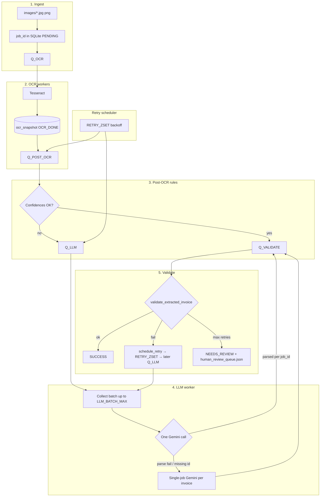

# Invoice OCR pipeline

A batch-oriented system that ingests receipt images from a folder, runs **Tesseract OCR** and **rule-based extraction**, escalates low-confidence or validation-failing cases to **Google Gemini**, and validates structured fields before persisting results. Processing is **parallel and queue-driven**: **Redis** holds work queues, **SQLite** (WAL mode) stores job state, and multiple **worker processes and threads** handle OCR, post-OCR rules, LLM calls, validation, and retries.

**Yes — the LLM stage often processes several invoices in a single Gemini request.** Workers dequeue up to `LLM_BATCH_MAX` jobs (default 3), wait briefly to fill the batch, build one prompt containing multiple receipts’ OCR text, issue **one** API call, then split the structured response per `job_id`. If batch parsing fails or a job is missing from the model output, the system **falls back to one API call per invoice** so nothing is silently dropped.

The primary entrypoint is [`main.py`](main.py). **Google Forms** submission (optional) posts only **`valid_invoices`** (terminal `SUCCESS` rows), failed jobs requires human review thus stored in human_review_queue.

---

## What you get

| Capability | Details |
|------------|---------|
| Parallel throughput | Configurable OCR processes, LLM worker thread(s), post-OCR and validate thread pools |
| Batched LLM | Up to N invoices per Gemini call (`LLM_BATCH_MAX`, timing via `LLM_BATCH_*_WAIT_SEC`) |
| Durable jobs | SQLite-backed `InvoiceJob` rows survive restarts |
| Cost-aware AI | Rules first; Gemini when rule confidences are low or validation requests a stricter LLM pass |
| Observability | Structured `[pipeline]` logs, Redis-backed counters (`metrics` in export JSON) |
| Human handoff | Jobs that exhaust retries become `NEEDS_REVIEW` and appear in `results/human_review_queue.json` |
| Form integration | After each one-shot run,  HTTP POST of successes to a Google Form |

---

## Requirements

- **Python** 3.10+ (recommended)
- **Redis** 6+ reachable at `REDIS_URL` (default `redis://127.0.0.1:6379/0`)
- **Tesseract** on the host (Windows default path is set in [`config/settings.py`](config/settings.py); override with `TESSERACT_CMD`)
- **Google AI API key** for Gemini (`GEMINI_API_KEY` in `.env`)

```bash
pip install -r requirements.txt
docker compose up -d
```

See [`docker-compose.yml`](docker-compose.yml) for the bundled Redis service.

---

## Configuration

1. Copy [`.env.example`](.env.example) to `.env` in the project root.
2. Set at least `GEMINI_API_KEY`.
3. Adjust paths (`IMAGES_DIR`, `TESSERACT_CMD`), Redis URL, pipeline timeouts, worker counts, and LLM batch settings as needed.

All tunables live in [`config/settings.py`](config/settings.py) (loaded via `python-dotenv`). [`workers/config.py`](workers/config.py) re-exports queue and worker constants for code under `workers/`.

---

## Quick start

```bash
python main.py
```

This resets Redis metrics (unless `EVAL_KEEP_METRICS=1`), optionally resets `results/human_review_queue.json` (unless `EVAL_ACCUMULATE_HUMAN_REVIEW=1`), starts workers, ingests top-level images under `IMAGES_DIR`, waits for terminal job states, writes `results/pipeline_export.json`, `pipeline_export.csv`, and `evaluation_summary.json`, and **by default** submits `valid_invoices` to the Google Form.

| Command | Effect |
|---------|--------|
| `python main.py` | One-shot: wait, export, submit (if enabled), exit |
| `python main.py --pipeline-timeout 1200` | Cap wait at 1200 seconds |
| `python main.py --no-submit-form` | Skip form POST |
| `python main.py --submit-form` | Force submit if `SUBMIT_AFTER_PIPELINE=0` in `.env` |
| `python main.py --pipeline-daemon` | Keep workers after ingest (no automatic wait/export in this mode) |

Start Redis first (`docker compose up -d`), then run `python main.py` from the project root.

---

## Output artifacts (latest run)

| File | Purpose |
|------|---------|
| [`results/pipeline_export.json`](results/pipeline_export.json) | `valid_invoices`, `needs_human_review`, `legacy_dlq`, `non_terminal`, `summary`, `metrics`, `observability` |
| [`results/pipeline_export.csv`](results/pipeline_export.csv) | Flattened rows |
| [`results/evaluation_summary.json`](results/evaluation_summary.json) | Run-level outcomes derived from the export |
| [`results/human_review_queue.json`](results/human_review_queue.json) | Rich detail for `NEEDS_REVIEW` jobs |

---

## End-to-end pipeline (step by step)

Each image becomes one **`InvoiceJob`** (`job_id`). State is stored in SQLite; **Redis list queues** move work between stages; a **sorted set** (`RETRY_ZSET`) holds delayed retries with exponential backoff.

### 1. Ingestion

[`workers/tasks/ingestion.py`](workers/tasks/ingestion.py) scans **only the top level** of `IMAGES_DIR` for `.jpg` / `.jpeg` / `.png`, creates a row (`PENDING`), and **LPUSH**es `{"job_id": ...}` to **`Q_OCR`**. Re-ingesting the same `job_id` is idempotent (existing DB row is not duplicated).

### 2. OCR (multiprocess)

[`workers/core/ocr_worker.py`](workers/core/ocr_worker.py) runs **N parallel processes** (`OCR_PROCESSES`). Each job: load image → **Tesseract** via [`ocr/ocr.py`](ocr/ocr.py) → serialize OCR regions into **`ocr_snapshot`** on the job row → status **`OCR_DONE`** → enqueue **`Q_POST_OCR`**. Failures increment **`retry_count`**; after **`max_retries`**, the job is finalized as **`NEEDS_REVIEW`** and appended to **`human_review_queue.json`**.

### 3. Post-OCR rules and routing

[`workers/core/post_ocr_worker.py`](workers/core/post_ocr_worker.py) reads **`ocr_snapshot`**, runs **regex/heuristic extraction** ([`pipeline/stages.py`](pipeline/stages.py)), and computes confidences for vendor, total, and date.

- If **all** confidences pass thresholds (**fast path**): build **`extraction_payload`** with source **`OCR_RULE`**, set status **`VALIDATING`**, enqueue **`Q_VALIDATE`** — **no LLM call**.
- If **any** field is too uncertain: increment **`llm_fallback_routed`**, set **`LLM_PENDING`**, **LPUSH** to **`Q_LLM`** with a **strategy** string (e.g. `default`, later `after_validation_fail`, `ocr_retry`).

So many receipts never hit Gemini; only “hard” rows consume API quota.

### 4. LLM extraction — including **batched multi-invoice** calls

[`workers/core/llm_worker.py`](workers/core/llm_worker.py) implements **batch collection**: block on **`Q_LLM`** for up to **`LLM_BATCH_FIRST_WAIT_SEC`**, then pull more messages with short **`LLM_BATCH_INTER_WAIT_SEC`** timeouts until **`LLM_BATCH_MAX`** jobs are collected (or the queue is empty).

- **Batch path:** [`pipeline/llm_batch/batch_llm.py`](pipeline/llm_batch/batch_llm.py) merges strategies with **`merge_batch_strategies`** (the strictest wins: e.g. `ocr_retry` over `default`), builds **one prompt** listing multiple `(job_id, image path, OCR text)` tuples ([`pipeline/llm_batch/prompt_builder.py`](pipeline/llm_batch/prompt_builder.py)), calls **`gemini_llm_call`** **once**, parses JSON with [`pipeline/llm_batch/batch_parser.py`](pipeline/llm_batch/batch_parser.py). For each `job_id` in the response, write **`extraction_payload`**, set **`VALIDATING`**, enqueue **`Q_VALIDATE`**. Metrics: **`llm_invocations`** += 1, **`llm_batch_calls`** += 1.

- **Fallback:** If the batch response does not parse or a **`job_id`** is missing from the parsed map, those jobs run **`_execute_single_llm`** — **one Gemini call per invoice** — and metrics increment **`llm_single_calls`**.

- **Exceptions:** On batch exception, **all** jobs in the batch fall back to single-job calls.

This design **reduces API round-trips** when several invoices wait for the LLM at once, while keeping a **safe degradation path** when the model returns malformed or incomplete batch JSON.

### 5. Validation

[`workers/core/validate_worker.py`](workers/core/validate_worker.py) runs [`pipeline/validation/validation_layer.py`](pipeline/validation/validation_layer.py) on **`extraction_payload`** (from rules or LLM).

- **Pass:** Normalize vendor/date/total, set **`SUCCESS`**, persist final columns, increment **`success_total`**.
- **Fail (retries left):** Schedule a **delayed retry** onto **`RETRY_ZSET`** with **`target_queue=Q_LLM`** and a **new strategy** from [`workers/retry/retry_strategy.py`](workers/retry/retry_strategy.py) (stricter prompt). After backoff, [`workers/retry/retry_ops.py`](workers/retry/retry_ops.py) moves the job back to **`Q_LLM`**.
- **Fail (no retries left):** **`NEEDS_REVIEW`**, merge into **`human_review_queue.json`**.

### 6. Retry scheduler

A background thread runs **`retry_scheduler_loop`**: periodically inspects **`RETRY_ZSET`** for scores ≤ now, **LPUSH**es the stored payload back to the target queue (usually **`Q_LLM`** or OCR/validate depending on failure class). Delay grows roughly **`RETRY_BASE_SEC * 2^retry_count`** capped by **`RETRY_CAP_SEC`**, with small jitter.

### 7. Orchestrator shutdown and export

[`workers/tasks/orchestrator.py`](workers/tasks/orchestrator.py) (invoked from [`main.py`](main.py)) waits until all ingested jobs reach a **terminal** state (`SUCCESS`, **`NEEDS_REVIEW`**, legacy DLQ, etc.) or hits **timeout**. Then [`workers/tasks/export_results.py`](workers/tasks/export_results.py) writes **`pipeline_export.json`** / **`.csv`**, and [`pipeline/evaluation/evaluation_summary.py`](pipeline/evaluation/evaluation_summary.py) writes **`evaluation_summary.json`**.

### Architecture diagram



---

## Project intricacies

| Topic | Behavior |
|-------|----------|
| **Batch vs single LLM** | Prefer one request for many jobs; **single-invoice** calls on parse errors, missing `job_id`, or exceptions — see [`llm_worker.py`](workers/core/llm_worker.py) `_llm_batch_once` / `_execute_single_llm`. |
| **Strategy merge** | In a batch, the **strictest** prompt strategy applies to the whole prompt (`merge_batch_strategies`). |
| **Metrics** | Redis counters (`METRICS`) reset at each pipeline start unless **`EVAL_KEEP_METRICS=1`**; export JSON embeds a snapshot for that run. |
| **Human review file** | Default: **empty** `human_review_queue.json` at run start; set **`EVAL_ACCUMULATE_HUMAN_REVIEW=1`** to merge across runs. |
| **SQLite** | WAL mode and busy handling support concurrent workers; avoid locking the DB file exclusively in other tools during runs. |
| **Idempotent ingest** | Same `job_id` in DB skips duplicate enqueue. |
| **Circuit breaker (optional)** | [`workers/utils/circuit_breaker.py`](workers/utils/circuit_breaker.py) implements an in-process breaker; `CB_*` settings exist in [`config/settings.py`](config/settings.py) for wiring if you extend the LLM client. |

For package-level layout, see [`workers/README.md`](workers/README.md).

---

## Google Form submission

The form integration is **HTTP POST** from [`submit/service.py`](submit/service.py) to Google’s **`formResponse`** endpoint. It is **not** the Google Forms API with OAuth; it mirrors a browser submission.

### What gets sent

- Only rows from the **`valid_invoices`** array in **`pipeline_export.json`**. Those are **successful** pipeline outcomes (`status` **`SUCCESS`** after validation).
- Rows that failed validation, went to **LLM** but never passed, or sit in **`needs_human_review`** are **not** in `valid_invoices` and are **never** posted.
- Each invoice becomes **application/x-www-form-urlencoded** fields: vendor, date, total, mapped via **`SUBMIT_ENTRY_*`** (the `entry.xxxxx` IDs from the form).

### Configuration

| Variable | Role |
|----------|------|
| `SUBMIT_FORM_URL` | Full URL ending in `/formResponse` |
| `SUBMIT_ENTRY_VENDOR` / `SUBMIT_ENTRY_DATE` / `SUBMIT_ENTRY_TOTAL` | Form field IDs (`entry.…`) |
| `SUBMIT_AFTER_PIPELINE` | `1` (default): run submit after `main.py` one-shot; `0`: skip unless `--submit-form` |
| `SUBMIT_MAX_RETRIES`, `SUBMIT_DELAY`, `SUBMIT_TIMEOUT` | Per-invoice retries, pause between posts, HTTP timeout |

Copy IDs from the form editor: **⋮ → Get pre-filled link**, submit a test row, and copy query parameter names into `.env`.

### When it runs

- **Automatic:** After export when you run `python main.py` and **`SUBMIT_AFTER_PIPELINE`** is enabled (default).
- **Manual:** `python -m submit` (defaults to `results/pipeline_export.json`) or `python -m submit --export path/to/export.json`.

### Operational notes

- The client sends a normal **browser-like User-Agent**; responses in the **2xx** range are treated as success.
- If HTTP succeeds but the **spreadsheet stays empty**, the **`entry.xxxxx`** names usually do not match the live form — fix IDs and URL.
- Rate limiting: **`SUBMIT_DELAY`** spaces posts so large batches do not hammer the endpoint.

---

## Optional tooling

| Item | Description |
|------|-------------|
| `python -m workers.run_pipeline` | Workers only (no `main.py` ingest/export) |
| `uvicorn workers.api:app` | Optional API ([`workers/api.py`](workers/api.py)) |

---

## Project layout (abbreviated)

```
├── main.py                 # Orchestrator: workers → ingest → wait → export → eval → form
├── config/                 # settings, logging
├── pipeline/               # Validation, batch LLM, prompts, evaluation summary
├── workers/                # Queues, DB, workers, export, human review
├── ocr/                    # Tesseract helpers
├── llm/                    # Gemini client
├── submit/                 # Google Form POST
├── invoice_submission/     # Legacy-compatible wrappers (same form config)
├── data/                   # SQLite (`invoices.db`)
├── images/                 # Default input images
├── results/                # Exports and evaluation output
└── docker-compose.yml      # Local Redis
```

---

## Troubleshooting

| Symptom | What to check |
|---------|----------------|
| Redis connection errors | `docker compose ps`, `REDIS_URL` |
| SQLite locked | WAL configured; close external DB viewers |
| Empty `valid_invoices` | OCR/validation failures; see `needs_human_review` |
| Form 2xx but no rows | Wrong `entry.xxxxx` or form URL |
| High `llm_single_calls` | Batch parse failures — inspect logs for `batch_parse_failed_fallback_singles` |
| Gemini 429 / quota | `GEMINI_RPM`, `GEMINI_429_MAX_RETRIES`, reduce `OCR_PROCESSES` / batch frequency |

Logs: [`logs/app.log`](logs/app.log) via [`config/logger_setup.py`](config/logger_setup.py).

---

## License / evaluation

This repository is intended for **reproducible batch processing**, **clear rules-vs-LLM boundaries**, and **auditable exports**. Replace default form URLs and entry IDs with your own Google Form for production.
