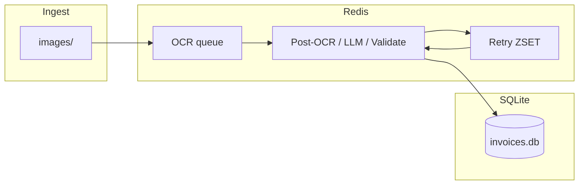

# Invoice OCR pipeline

A batch-oriented system that ingests receipt images from a folder, runs **Tesseract OCR** and **rule-based extraction**, escalates low-confidence cases to **Google Gemini**, validates structured fields, and writes machine-readable results. Processing is **parallel and queue-driven**: **Redis** holds work queues, **SQLite** (WAL mode) stores job state, and multiple **worker processes and threads** handle OCR, post-OCR rules, LLM calls, validation, and retries.

The primary entrypoint is [`main.py`](main.py). Optional **Google Forms** submission posts only **validated successful** rows (`valid_invoices`), never items queued for human review.

---

## What you get

| Capability | Details |
|------------|---------|
| Parallel throughput | Configurable OCR processes, LLM pool, post-OCR and validate threads |
| Durable jobs | SQLite-backed `InvoiceJob` rows survive restarts |
| Cost-aware AI | Rules and heuristics first; Gemini used when confidence is low or validation fails |
| Observability | Structured `[pipeline]` logs, Redis-backed counters (`metrics` in export JSON) |
| Human handoff | Jobs that exhaust retries become `NEEDS_REVIEW` and appear in `results/human_review_queue.json` |
| Form integration | After each one-shot run, optional POST of `valid_invoices` to a Google Form (configurable) |

---

## Requirements

- **Python** 3.10+ (recommended)
- **Redis** 6+ reachable at `REDIS_URL` (default `redis://127.0.0.1:6379/0`)
- **Tesseract** on the host (Windows default path is set in [`config/settings.py`](config/settings.py); override with `TESSERACT_CMD`)
- **Google AI API key** for Gemini (`GEMINI_API_KEY` in `.env`)

Install dependencies:

```bash
pip install -r requirements.txt
```

Start Redis with Docker from the project root:

```bash
docker compose up -d
```

See [`docker-compose.yml`](docker-compose.yml) for the bundled Redis service.

---

## Configuration

1. Copy [`.env.example`](.env.example) to `.env` in the project root.
2. Set at least `GEMINI_API_KEY`.
3. Adjust paths (`IMAGES_DIR`, `TESSERACT_CMD`), Redis URL, pipeline timeouts, and worker counts as needed.

All tunables are centralized in [`config/settings.py`](config/settings.py), which loads `.env` via `python-dotenv`. The [`workers/config.py`](workers/config.py) module re-exports queue and worker settings for imports inside the `workers` package.

---

## Quick start

From the project root (with Redis running):

```bash
python main.py
```

This will:

1. Reset Redis metrics (unless `EVAL_KEEP_METRICS=1`).
2. Optionally reset `results/human_review_queue.json` for this run (unless `EVAL_ACCUMULATE_HUMAN_REVIEW=1`).
3. Start workers, ingest all top-level `.jpg` / `.jpeg` / `.png` files under `IMAGES_DIR` (default `images/`), wait for terminal states, export `results/pipeline_export.json` and `pipeline_export.csv`, write `results/evaluation_summary.json`, and **by default** submit `valid_invoices` to the configured Google Form.

### Useful CLI flags

| Command | Effect |
|---------|--------|
| `python main.py` | One-shot: wait, export, submit (if enabled), exit |
| `python main.py --pipeline-timeout 1200` | Wait up to 1200 seconds for all jobs |
| `python main.py --no-submit-form` | Skip Google Form POST after export |
| `python main.py --submit-form` | Force submit even if `SUBMIT_AFTER_PIPELINE=0` in `.env` |
| `python main.py --pipeline-daemon` | Keep workers running after ingest (no automatic wait/export in this mode) |

Timeout default comes from `PIPELINE_WAIT_TIMEOUT_SEC` (see `.env.example`).

### Windows helper

[`scripts/run_pipeline.ps1`](scripts/run_pipeline.ps1) starts Docker Compose Redis then runs `main.py`, forwarding extra arguments:

```powershell
.\scripts\run_pipeline.ps1 --pipeline-timeout 900
```

[`scripts/run_pipeline.bat`](scripts/run_pipeline.bat) is available for cmd-style shells.

---

## Output artifacts (latest run)

Files under `results/` reflect the **most recent** one-shot pipeline execution:

| File | Purpose |
|------|---------|
| [`results/pipeline_export.json`](results/pipeline_export.json) | `valid_invoices`, `needs_human_review`, `legacy_dlq`, `non_terminal`, `summary`, `metrics`, `observability` |
| [`results/pipeline_export.csv`](results/pipeline_export.csv) | Flattened rows for spreadsheets |
| [`results/evaluation_summary.json`](results/evaluation_summary.json) | Aggregated outcomes and failure-mode hints derived from the export |
| [`results/human_review_queue.json`](results/human_review_queue.json) | Detailed records for jobs that need manual review (merged by `job_id` during the run unless accumulation is enabled) |

Older aggregate filenames such as `pipeline_export_all.json` are not produced by the current code path.

---

## Google Form submission

- **Implementation:** [`submit/service.py`](submit/service.py) reads `valid_invoices` only; rows in the human-review queue are never submitted.
- **Automatic run:** Controlled by `SUBMIT_AFTER_PIPELINE` (default on) and `--no-submit-form` / `--submit-form`. Form URL and field entry IDs: `SUBMIT_FORM_URL`, `SUBMIT_ENTRY_VENDOR`, `SUBMIT_ENTRY_DATE`, `SUBMIT_ENTRY_TOTAL`.
- **Manual run** (reuse an existing export without re-running the pipeline):

```bash
python -m submit
python -m submit --export results/pipeline_export.json
```

Use the form’s **pre-filled link** in the Google Forms UI to discover correct `entry.xxxxx` identifiers if responses do not appear in the linked sheet.

---

## Architecture (high level)



- **OCR workers** (multiprocess) run Tesseract and push snapshots into the DB and next stages.
- **Post-OCR** applies rules and may route to **LLM** (batched where configured).
- **Validate** enforces business rules; failures can schedule **retries** with backoff.
- **Retry scheduler** moves due jobs from the ZSET back onto the appropriate queues.

For a finer-grained map of Python packages, see [`workers/README.md`](workers/README.md).

---

## Optional tooling

| Item | Description |
|------|-------------|
| `python -m workers.run_pipeline` | Long-running workers only (no ingest orchestration from `main.py`) |
| `uvicorn workers.api:app` | Optional HTTP API (see [`workers/api.py`](workers/api.py); mentioned in daemon mode help text) |
| [`scripts/evaluation_run.py`](scripts/evaluation_run.py) | Clears Redis (best-effort), optional fresh DB, runs the pipeline, prints outcome summary |

---

## Project layout (abbreviated)

```
├── main.py                 # Orchestrator: workers → ingest → wait → export → eval → form
├── config/                 # settings, logging
├── pipeline/               # Validation, LLM batching, evaluation summary writer
├── workers/                # Queues, DB, OCR/LLM/validate workers, export
├── ocr/                    # Tesseract helpers
├── llm/                    # Gemini client
├── submit/                 # Google Form POST
├── invoice_submission/     # Legacy-compatible wrappers around the same form config
├── scripts/                # PowerShell/batch helpers, evaluation script
├── data/                   # SQLite database (default `invoices.db`)
├── images/                 # Default input images
├── results/                # Exports and evaluation output
└── docker-compose.yml      # Local Redis
```

---

## Troubleshooting

| Symptom | What to check |
|---------|----------------|
| `Connection refused` to Redis | `docker compose ps`, firewall, `REDIS_URL` |
| `database is locked` | SQLite WAL and timeouts are configured; avoid opening the DB file exclusively elsewhere during runs |
| Empty `valid_invoices` | Validation or OCR failures; inspect `needs_human_review` and `human_review_queue.json` |
| Form posts succeed (HTTP 2xx) but sheet empty | Wrong `entry.xxxxx` IDs or form URL; verify with a pre-filled test submission |
| Gemini rate limits | `GEMINI_RPM`, `GEMINI_429_MAX_RETRIES`, or reduce parallelism |

Logs default to [`logs/app.log`](logs/app.log) via [`config/logger_setup.py`](config/logger_setup.py) (adjust there if your deployment needs JSON or stdout-only).

---

## License / evaluation

This repository is structured for **reproducible batch processing**, **clear separation of rules vs LLM**, and **auditable exports**. Replace default form URLs and entry IDs with your own Google Form before production use.
